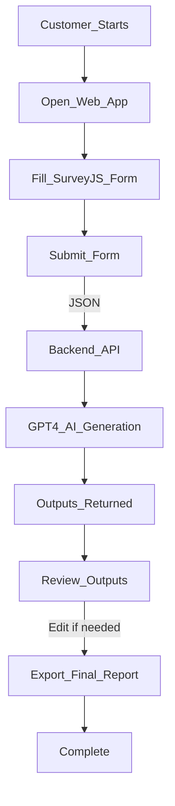

# ImpactCanvas Project Documentation

## Overview
ImpactCanvas is an innovative web application designed to automate the generation of clear, actionable Theory of Change (ToC) statements, recommended impact activities, and monitoring plans for social-impact and environmental non-profits. The solution leverages OpenAI's GPT technology to simplify strategic planning for impact-driven organisations.

## Problem Statement
Social and environmental non-profits often find creating structured impact plans challenging due to limited resources and expertise. ImpactCanvas streamlines this process, making strategic impact planning quick, accessible, and effective.

## Solution Summary
ImpactCanvas uses a simplified digital canvas form to capture key project information from users. This structured input is then processed by an AI-powered assistant, ImpactGPT, built on OpenAI’s GPT-4, to instantly produce professional and actionable outputs:

- Concise **Theory of Change** narratives
- Tailored lists of **Impact Activities**
- Structured **Monitoring & Evaluation (M&E) Plans**

## Technology Stack

### Frontend
- **Framework**: React
- **Form Component**: SurveyJS (survey-react)
- **HTTP Client**: Axios

### Backend
- **Framework**: Python (FastAPI)
- **Language Model Integration**: OpenAI GPT-4 API
- **Data Format**: JSON

### Database
- Recommended: Supabase (PostgreSQL-based)
- Alternatives: Firebase, MongoDB Atlas

### Deployment
- Frontend: Vercel, Netlify
- Backend: Docker containers or AWS Lambda

## Workflow Diagram (Mermaid)



## Next Steps
- Implement minimal frontend using React and SurveyJS
- Setup FastAPI backend connected to GPT-4
- Conduct integration tests
- Deploy minimal viable solution for testing

Alternatively, configure and deploy the ImpactGPT Custom GPT directly via the OpenAI platform for rapid deployment without frontend/backend infrastructure.

## Future Enhancements
- Integration with CRM and M&E systems (Salesforce, Airtable)
- User accounts and project history management
- Advanced reporting and analytics

## Repository Structure Recommendation
```
ImpactCanvas/
├── frontend/               # React app with SurveyJS
├── backend/                # FastAPI backend code
├── docs/                   # Documentation (this file)
├── examples/               # Example canvases and outputs
├── GPT_configuration.md    # GPT configuration details
├── README.md               # Project overview and setup instructions
└── LICENSE                 # Licensing information
```
---

© ImpactCanvas | Making impactful projects easier and smarter.
